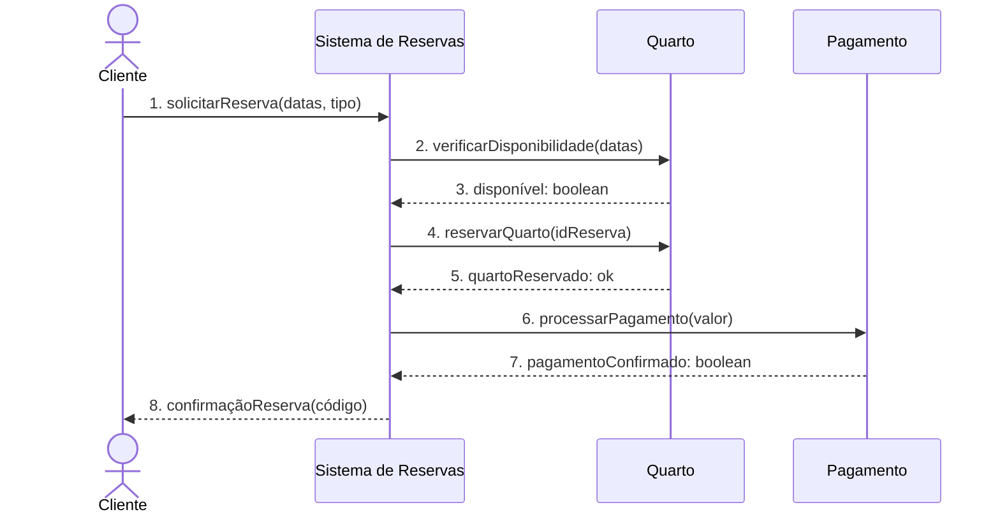
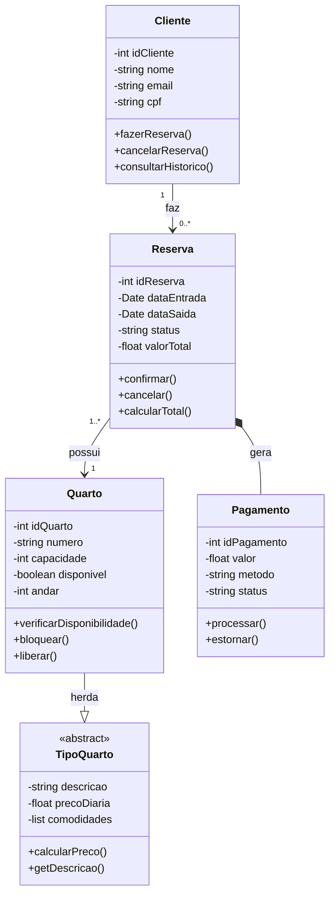
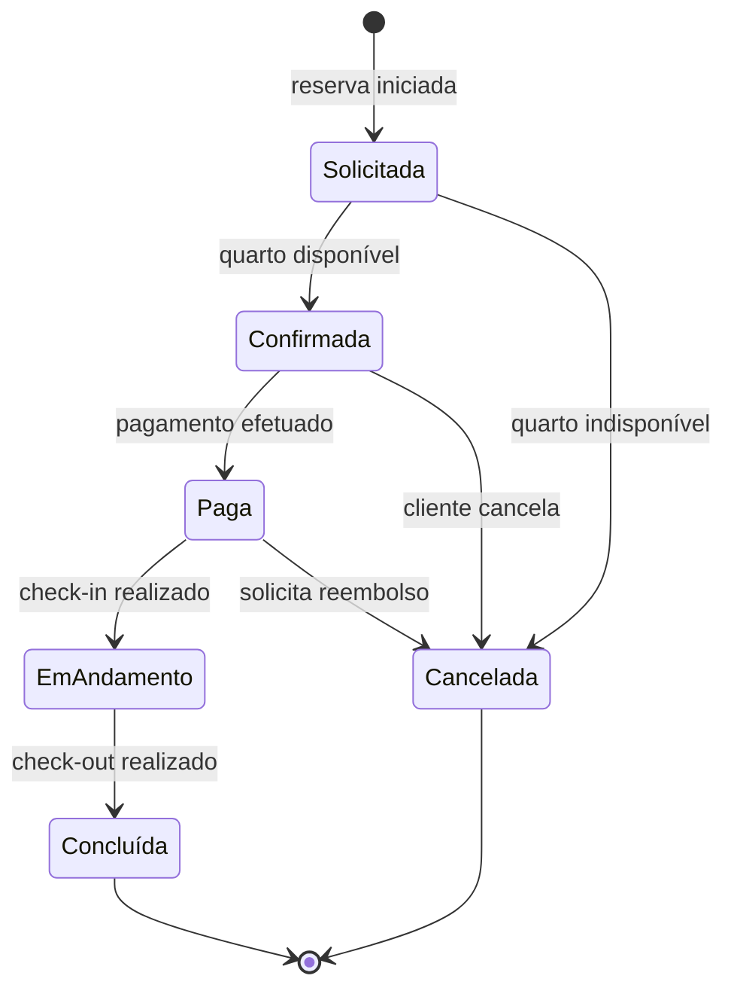

# Hotel Bela Vista — Modelagem UML (PIM)

> Atividade da Semana 9 — Modelagem de Sistemas e MDE  
> Disciplina: Engenharia de Software

---

## Sobre o Projeto

PIM (Platform Independent Model) do sistema de reservas do Hotel Bela Vista, com base nos requisitos validados junto ao cliente Sr. Geraldo. Os diagramas cobrem três perspectivas UML sem qualquer dependência de tecnologia específica — foco na **lógica de negócio**.

---

## Estudante 1 — Diagrama de Sequência Rafael
*Perspectiva de Interação: troca de mensagens ao realizar uma reserva*

**Fluxo principal:**
1. Cliente solicita reserva informando datas e tipo de quarto
2. Sistema consulta disponibilidade junto ao Quarto
3. Quarto responde com status de disponibilidade
4. Sistema solicita bloqueio do quarto
5. Quarto confirma o bloqueio
6. Sistema aciona o processamento do pagamento
7. Pagamento retorna confirmação
8. Sistema emite código de confirmação ao cliente

---

## Estudante 2 — Diagrama de Classes David
*Perspectiva Estrutural: entidades, atributos, métodos e relacionamentos*

**Relacionamentos:**

| Relação | Tipo | Multiplicidade |
|---------|------|----------------|
| Cliente → Reserva | Associação | 1 para 0..* |
| Reserva → Quarto | Associação | 1..* para 1 |
| Reserva → Pagamento | Composição | 1 para 1 |
| Quarto → TipoQuarto | Herança | — |

---

## Estudante 3 — Diagrama de Estados Andre
*Perspectiva Comportamental: ciclo de vida completo de uma reserva*

**Estados da Reserva:**

| Estado | Descrição |
|--------|-----------|
| `Solicitada` | Pedido enviado, aguardando verificação |
| `Confirmada` | Quarto disponível, aguardando pagamento |
| `Paga` | Pagamento confirmado, aguardando check-in |
| `Em Andamento` | Hóspede hospedado no hotel |
| `Concluída` | Check-out realizado com sucesso |
| `Cancelada` | Reserva encerrada antes da conclusão |

---

## Referência

> SOMMERVILLE, I. **Engenharia de software**. 10. ed. São Paulo: Pearson.
