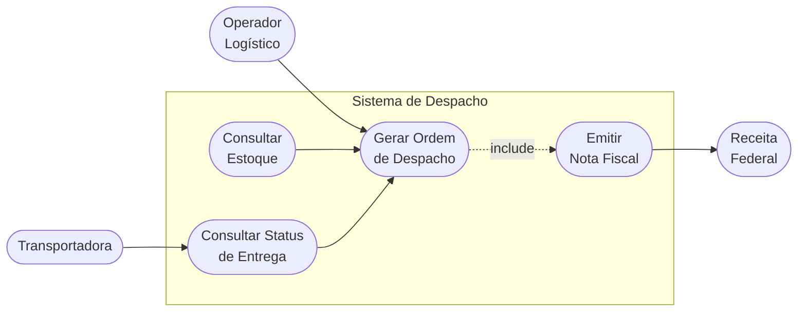
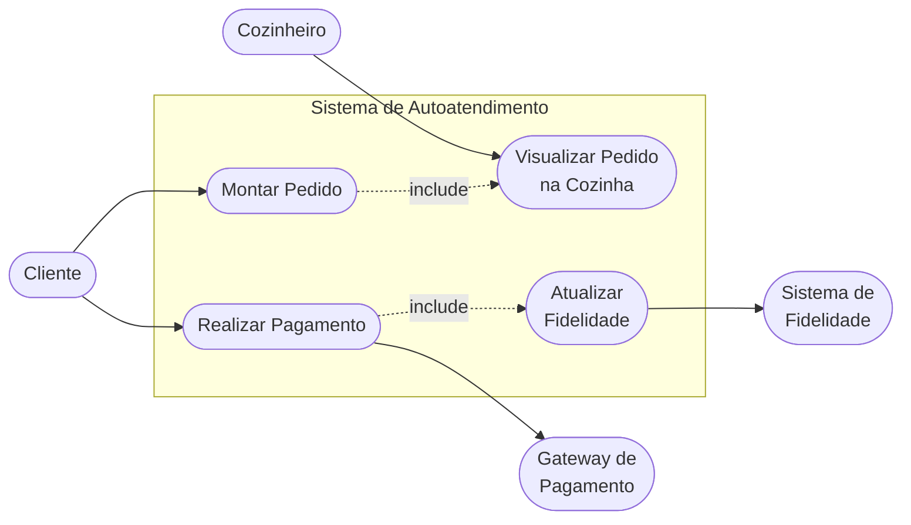
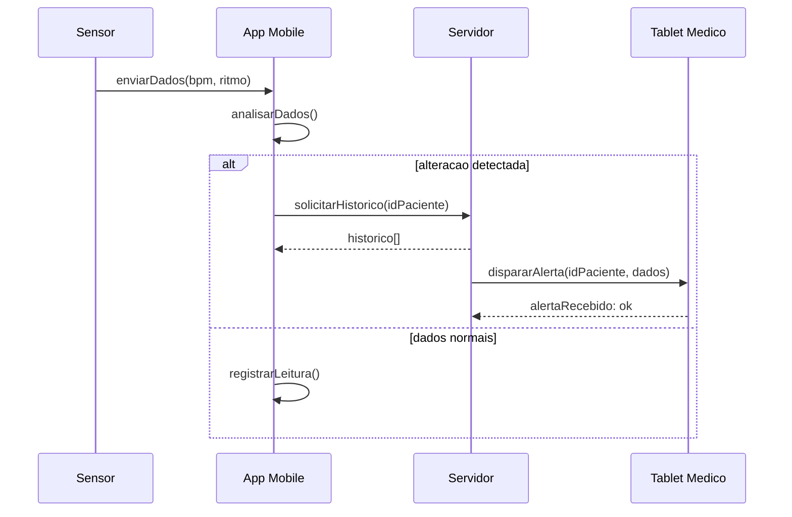
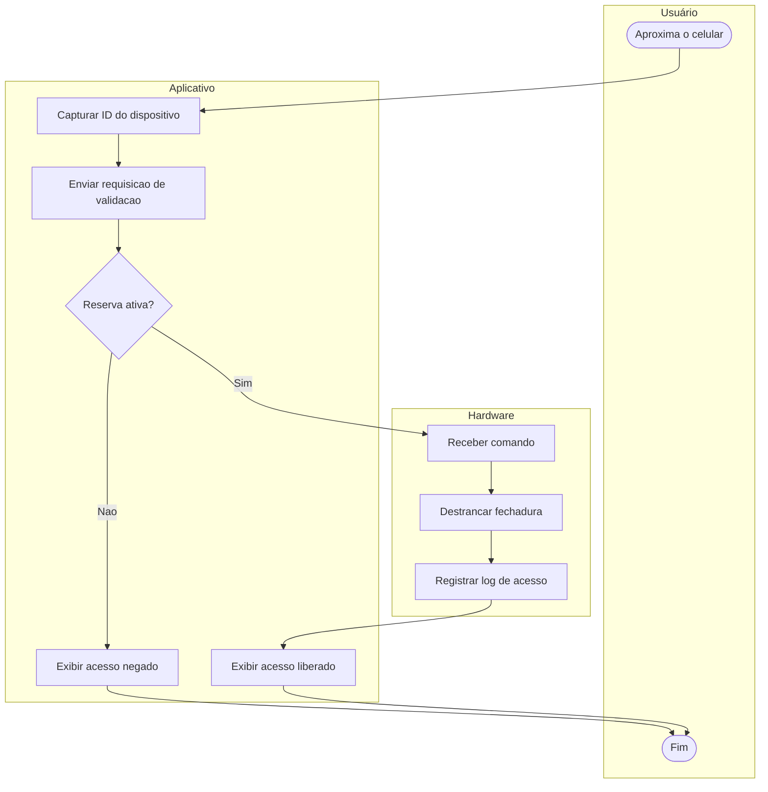
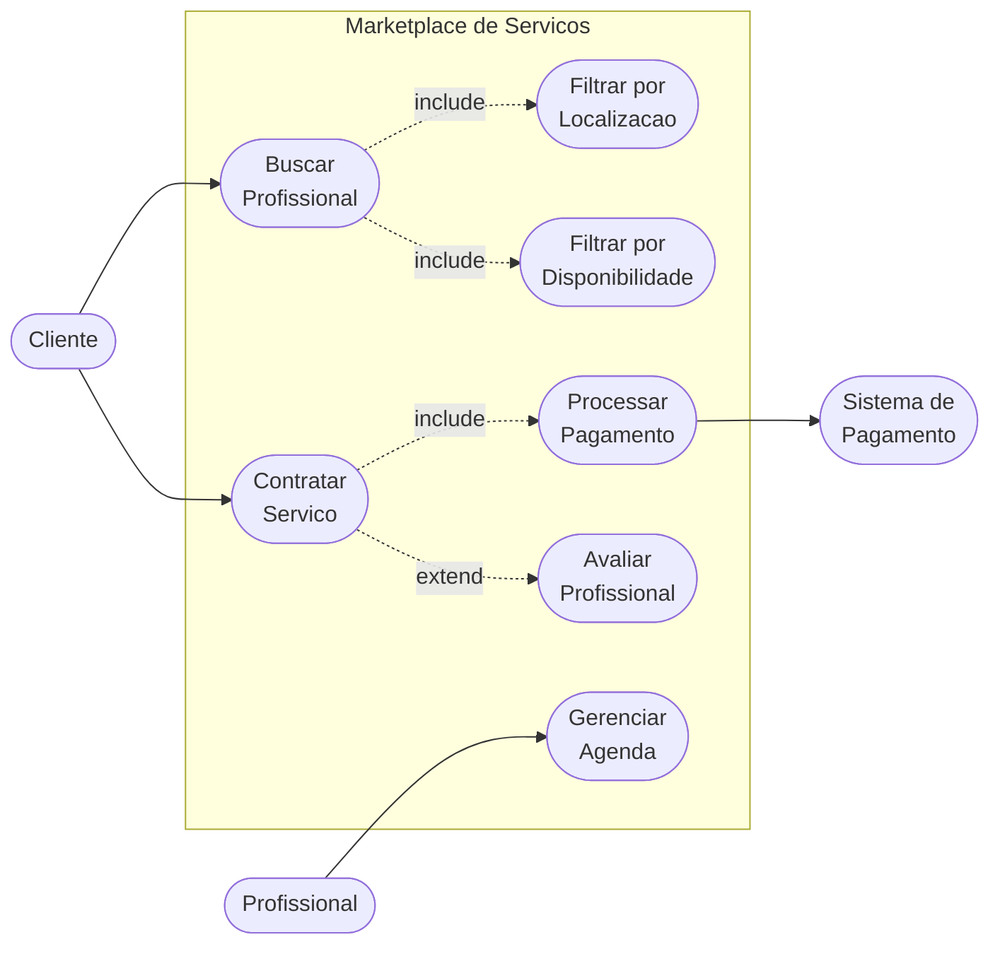

# Exercícios de Revisão — Semana 10
**Engenharia de Software** | Prof. Gaio B. Oliveira | 28/04/2026

---

## Cenário 1 — Logística de E-commerce Global

**Diagrama:** Casos de Uso

---

## Cenário 2 — Totem de Autoatendimento em Fast-Food

**Diagrama:** Casos de Uso

---

## Cenário 3 — Sistema de Telemedicina

**Diagrama:** Sequência

---

## Cenário 4 — Controle de Acesso Inteligente

**Diagrama:** Atividades com Swimlanes

---

## Cenário 5 — Marketplace de Serviços Domésticos

**Diagrama:** Casos de Uso com include e extend

> `include` — execucao obrigatoria do caso de uso base  
> `extend` — execucao condicional ou opcional

---

## Referência

> SOMMERVILLE, I. **Engenharia de software**. 10. ed. São Paulo: Pearson.
